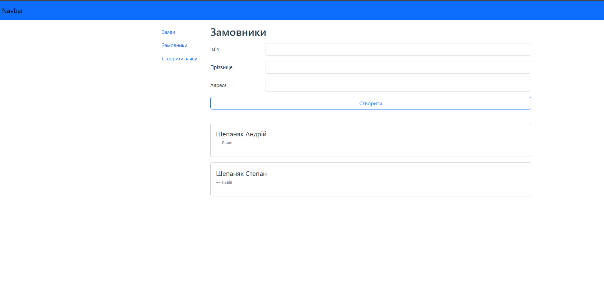
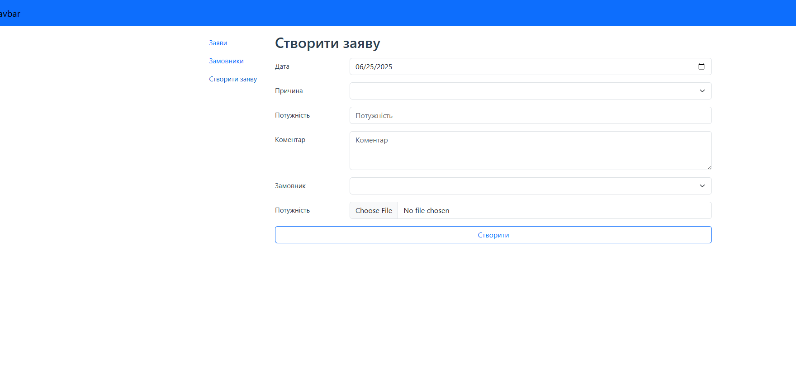
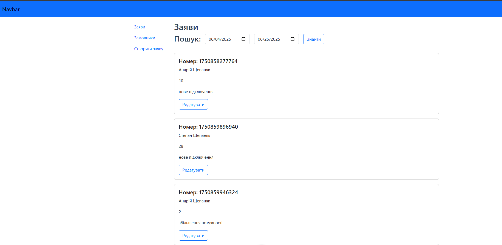
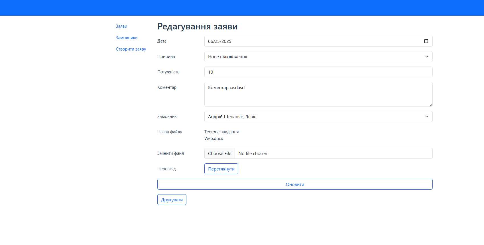
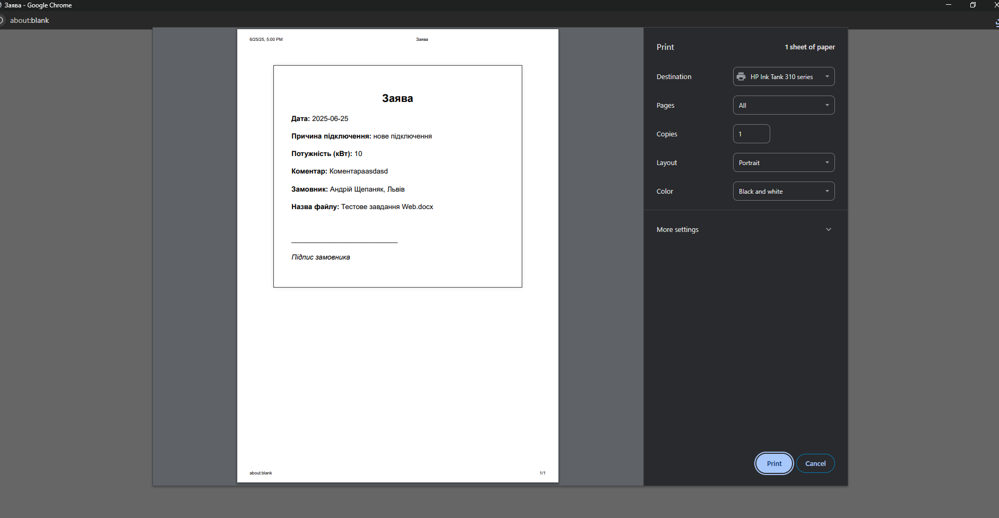

# vue-test-task

This template should help get you started developing with Vue 3 in Vite.

## Recommended IDE Setup

[VSCode](https://code.visualstudio.com/) + [Volar](https://marketplace.visualstudio.com/items?itemName=Vue.volar) (and disable Vetur).

## Customize configuration

See [Vite Configuration Reference](https://vite.dev/config/).

## Project Setup

```sh
npm install
```

### Compile and Hot-Reload for Development

```sh
npm run dev
```

### Compile and Minify for Production

```sh
npm run build
```

# Vue Test Task

## Функціональні Можливості

### 1. Управління Замовниками

### Ця секція дозволяє додавати нових замовників, переглядати існуючих замовників та їхню контактну інформацію.

### 2. Створення Заявок

### Функціонал для створення нових заявок, де користувач може вказати дату, причину, потужність, коментар та обрати замовника. Також є можливість завантажити файл.

### 3. Перегляд та Пошук Заявок

### Сторінка, що відображає список існуючих заявок. Доступний пошук заявок за датою. Кожна заявка містить номер, інформацію про замовника, потужність та причину. Є кнопка "Редагувати" для кожної заявки.

### 4. Редагування Заявки

### Детальна форма для редагування існуючої заявки. Тут можна змінити всі поля, які були вказані при створенні, а також завантажити новий файл або переглянути існуючий.

### 5. Друк Заявки

### Можливість друку заявки з усією відповідною інформацією, такою як дата, причина підключення, потужність, коментар та дані замовника.

## Технології
### Vue.js